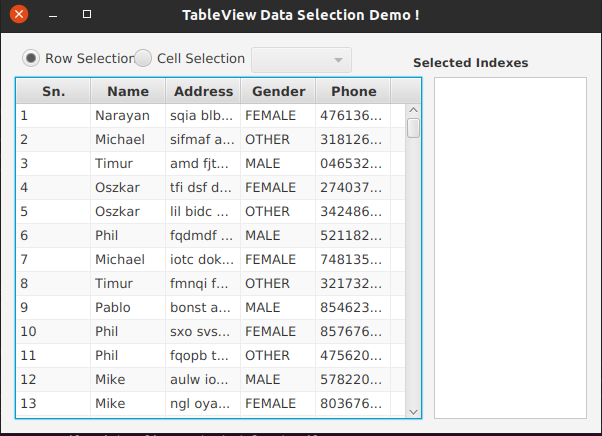

# JavaFX TableView Data Selection

This project is for doing the selection based upon the columns and row and show the index data of it. 

### Requirement
- JavaFX 14

### Usage
```shell script
mvn clean javafx:run
```

#### Output



